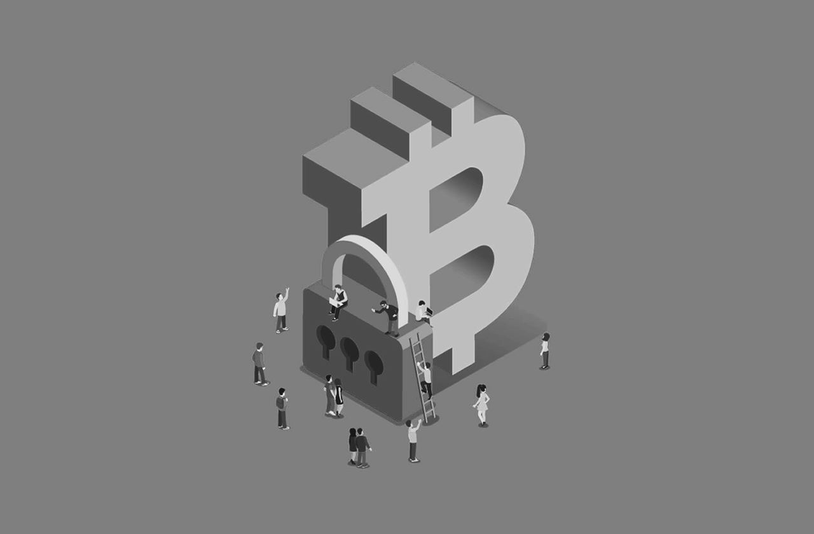

# Самые распространенные опасности и скамы биткоин-пространства

Биткоин-пространство, к сожалению, не лишено мошенников, а также изобилует подводными камнями. Этот пост призван указать на самые распространенные моменты, которых следует опасаться. Это касается не только настороженности в отношении к людям, которые просят вас поделиться сид-фразой или предлагают отправить им немного биткоинов, обещая высокий доход, но и повышенного внимания при взаимодействии с Биткоином.

---

## К каким методам стоит прибегнуть для обеспечения собственной безопасности в Биткоин-пространстве?

* Оставляя монеты у кастодианов (например, на биржах), вы рискуете потерять возможность вывести свои биткоины. Как правило, решение о передаче вам "ваших" монет остается за хранителем, то есть обладателем приватного ключа. Новички нередко оставляют биткоины на биржах или у сервисов-хранителей. Обычно рекомендуется минимизировать количество биткоинов, хранящихся у кастодианов, и вместо этого хранить большинство монет на собственном кошельке, приватные ключи к которому подконтрольны только вам.

* По мере роста стоимости биткоина вам также следует подумать о повышении уровня безопасности, рассмотрев [аппаратные кошельки](https://www.21ideas.org/practice-what-is-coldcard/), [мультиподпись](https://www.21ideas.org/tag/multisig/) и [другие](https://www.21ideas.org/theory-security-bitcoin-wallets/) программы и приложения с открытым исходным кодом.

* Вы можете быть параноиком, опасаясь, что хакеры могут украсть ваш биткоин, но куда чаще встречаются люди, потерявшие доступ к своим монетам из-за того, что они не сохранили или не протестировали резервные копии своих настроек. Многие теряют доступ к биткоинам из-за нестандартной или слишком запутанной схемы хранения. Нестандартные настройки могут быть трудновосстановимыми или невосстановимыми для ваших наследников в случае вашей смерти.

* Остерегайтесь тех, кто просит у вас сид-фразу. Одна из распространенных афер -- хакеры притворяются сотрудниками службы поддержки и просят у людей их сид "для того, чтобы помочь им".

* Не вводите свою сид-фразу в режиме онлайн, а в лучшем случае даже не сохраняйте ее в цифровом виде. Если вам необходимо восстановить сид, восстановите его в аппаратном кошельке, который позволяет повторно ввести сид непосредственно в аппаратное устройство, не подключенное к интернету. Многие потеряли свои монеты из-за того, что кейлоггеры на их компьютерах записывали сид в момент его ввода.

* Остерегайтесь тех, кто обещает доходы, которые не похожи на правду, будь то майнинг, торговля или что-то еще. Например, на некоторых платформах есть мошенники или скамботы, которые пытаются втянуть людей в аферы, обещающие очень высокие доходы (отправьте мне 1 биткоин и получите 2).

* Всегда храните резервную копию своей сид-фразы, в идеале — на [металлической пластине](https://store.coinkite.com/promo/970E08C1C7383C967C7B) или шайбах, например, BillFodl, CryptoSteel, CypherSafe, SEEDPLATE или чем-то подобном.

* При оплате или получении проверяйте адрес и детали транзакции на аппаратном устройстве. Известны случаи атак, основанных на подмене адреса, на который производится оплата.

* Используйте программное и аппаратное обеспечение, которое в идеале имеет открытый исходный код и проверено сообществом, с хорошей репутацией, заслуженной за годы безотказной работы.

* Опасайтесь "simjacking", когда мошенники получают контроль над телефоном своей жертвы, манипулируя процессами поставщика услуг телефонной связи. После этого они могут воспользоваться двухфакторной аутентификацией SMS и получить доступ к онлайн-счетам своей жертвы. Биткоинеры иногда становятся жертвами симджэкеров. Один из хороших способов защиты от них — не использовать двухфакторную аутентификацию через SMS, а обратиться к более безопасным методам, таким как приложения-аутентификаторы или устройства YubiKey. Подробнее о безопасности онлайн можно узнать из наших [бесед](https://youtube.com/playlist?list=PLfCndTr__6HfGT0XhfZKcp4EZimMKYGs4) с Грязиным.

*Больше информации о* [безопасности](https://www.21ideas.org/tag/security/) *и* [приватности](https://www.21ideas.org/privacy/) *можно узнать,*\
*перейдя по ссылкам* ***👈***.